# TOC
[Home - RAP620](../../#exercises)
# Exercise 1: Generate UI Service from scratch

## Introduction

In this exercise, you will create an ABAP package and generate a RAP business object including UI service from scratch.
With ADT you will be able to define all needed repository objects for a starter application using this wizard. This includes the data model, projection view, service definition and service binding. 
We will use a structure as a template for the **inventory** entity. Afterwards you will check your _Inventory_ application with the SAP Fiori elements preview. 

- [1.1 - Create Package](#exercise-11-create-package)
- [1.2 - Create structure](#exercise-12-create-structure)
- [1.3 - Generate the transactional UI services](#exercise-13-generate-the-transactional-ui-service)
- [1.4 - Preview the Inventory App](#exercise-14-preview-the-inventory-app)
- [Summary](#summary)  


> **Reminder:**   
> Don't forget to replace all occurences of the placeholder **`###`** with a unique group ID in the exercise steps below.  
> You can use the ADT function **Replace All** (**Ctrl+F**) to replace all occurencies of the placeholder **`###`** with your unique ID.  
> A good try for a unique ID would be to use your initials and a number of your choice.  
> When creating your package **`ZRAP620_###`** you will see which unique ID is still available.      

## Exercise 1.1: Create Package
[^Top of page](#exercise-1-generate-ui-service-from-scratch)

> Create your exercise package .   
>
> This ABAP package will contain all the artefacts you will be creating in the different exercises of this hands-on session.

 <details>
  <summary>Click to expand!</summary>

   1. In ADT, go to the **Project Explorer**, right-click on the package **`ZLOCAL`**, and select **New** > **ABAP Package** from the context menu. 
     
      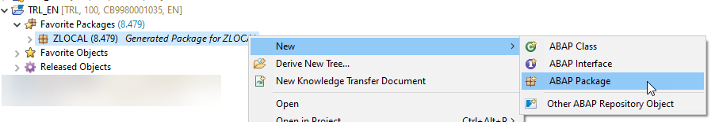
   
   2. Maintain the required information (`###` is your group ID):
       - Name: **`ZRAP620_###`**
       - Description: _**`RAP620 Package ###`**_
       - Select the check box **Add to favorites package**   


       - Superpackage: **`ZLOCAL`**   
       
      Click **Next>**.
 
      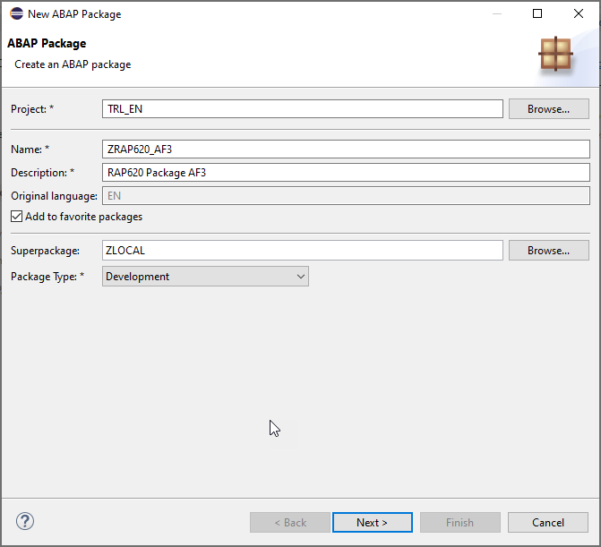
      
   
   3. Create a new transport request and add a description (e.g. _**RAP620 Package ###**_), and click **Finish**.
      
       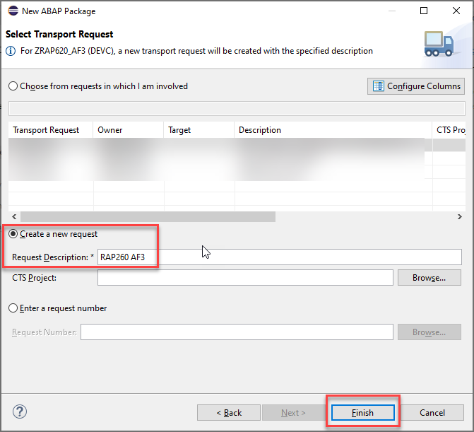

   4. Your Project Explorer should now look like follows:   
 
      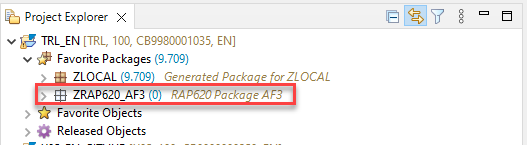
 
</details>

## Exercise 1.2: Create structure   
[^Top of page](#exercise-1-generate-ui-service-from-scratch)    

> Create a structure that serves as a template for the inventory entity
> An Inventory entity defines general inventory data, such as the inventory ID or product name, quantity of the product, and the price of the product.

<details>
  <summary>Click to expand!</summary>

   1. Right-click on your ABAP package **`ZRAP620_###`** and select **New** > **Other ABAP Repository Object** from the context menu.
   
   2. Search for **structure** and select then entry **structure** from the list, and click **Next >**.   
      
      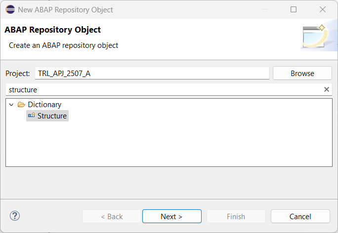  
   
   3. Maintain the required information (`###` is your group ID) and click **Next >**.
      - Name: **`ZRAP620_INVENTORY_###`**
      - Description: _**`Inventory data template`**_                  
             
      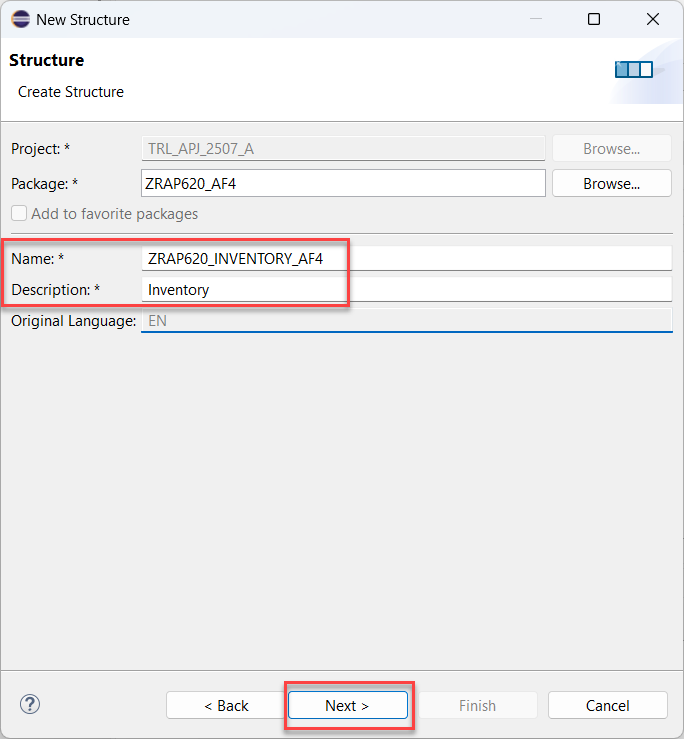
   
   4. Select a transport request, and click **Finish** to create the database table.       

   5. Replace the default code with the code snippet provided below and replace all occurences of the placeholder **`###`** with your group ID using the **Replace All** function (**Ctrl+F**).

   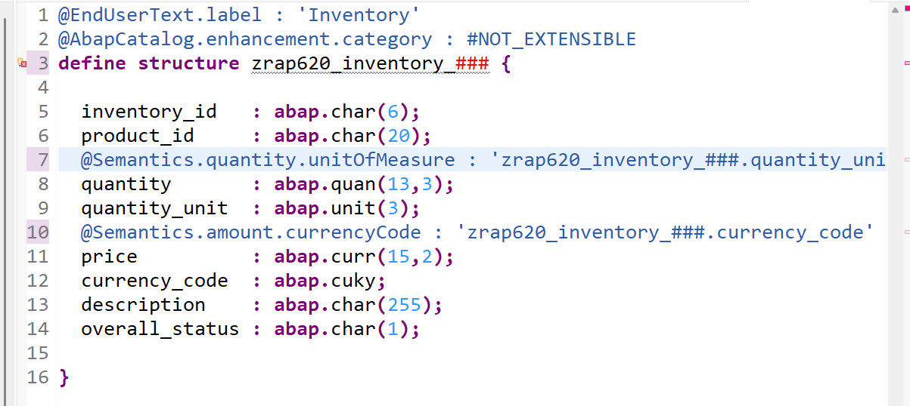   

   6. **Save** and **Activate** your changes.    
      
    

```ABAP 
@EndUserText.label : 'Inventory data template'
@AbapCatalog.enhancement.category : #NOT_EXTENSIBLE
define structure zrap620_inventory_### {

  inventory_id   : abap.char(6);
  product_id     : abap.char(20);
  @Semantics.quantity.unitOfMeasure : 'zrap620_inventory_###.quantity_unit'
  quantity       : abap.quan(13,3);
  quantity_unit  : abap.unit(3);
  @Semantics.amount.currencyCode : 'zrap620_inventory_###.currency_code'
  price          : abap.curr(15,2);
  currency_code  : abap.cuky;
  description    : abap.char(255);
  overall_status : abap.char(1);

}
``` 

</details>

<!--
## Exercise 1.2: Create database table
[^Top of page](#)

> Create a database table  to store the _Inventory_ data.   
> An Inventory entity defines general inventory data, such as the inventory ID or product name, quantity of the product, and the price of the product.

 <details>
  <summary>Click to expand!</summary>

   1. Right-click on your ABAP package **`ZRAP620_###`** and select **New** > **Other ABAP Repository Object** from the context menu.
 
      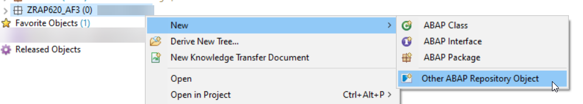  
   
   2. Search for **table** and select then entry **database table** from the list, and click **Next >**.   
      
      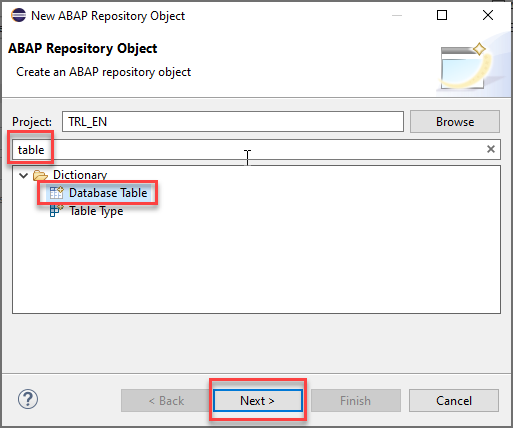
   
   3. Maintain the required information (`###` is your group ID) and click **Next >**.
      - Name: **`ZRAP620_INVEN###`**
      - Description: _**`Inventory data ###`**_                  
             
      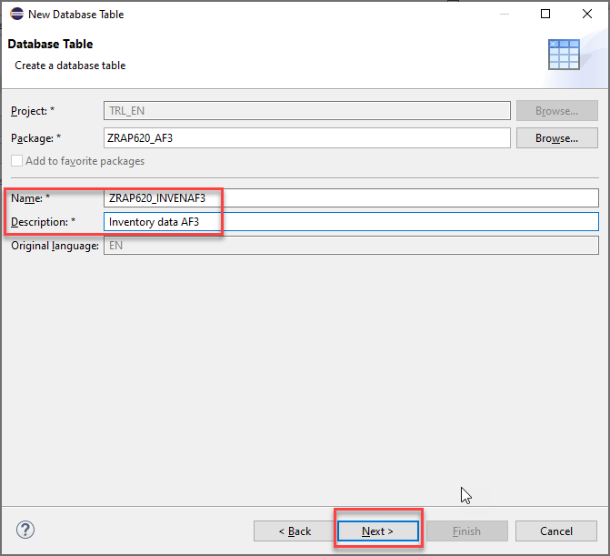
   
   4. Select a transport request, and click **Finish** to create the database table.
   
      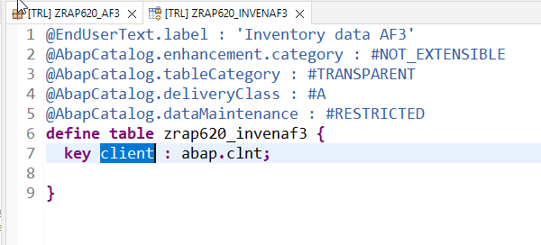

   5. Replace the default code with the code snippet provided below and replace all occurences of the placeholder **`###`** with your group ID using the **Replace All** function (**Ctrl+F**).

      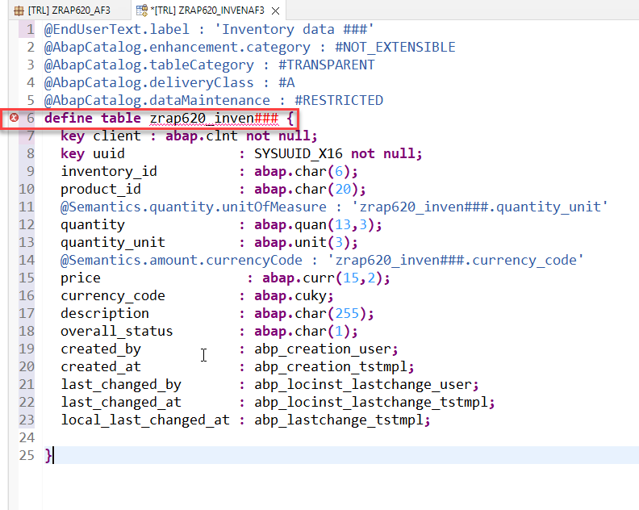   

    
```ABAP 
@EndUserText.label : 'Inventory data ###'
@AbapCatalog.enhancement.category : #NOT_EXTENSIBLE
@AbapCatalog.tableCategory : #TRANSPARENT
@AbapCatalog.deliveryClass : #A
@AbapCatalog.dataMaintenance : #RESTRICTED
define table zrap620_inven### {
  key client : abap.clnt not null;
  key uuid              : SYSUUID_X16 not null;
  inventory_id          : abap.char(6);
  product_id            : abap.char(20);
  @Semantics.quantity.unitOfMeasure : 'zrap620_inven###.quantity_unit'
  quantity              : abap.quan(13,3);
  quantity_unit         : abap.unit(3);
  @Semantics.amount.currencyCode : 'zrap620_inven###.currency_code'
  price                  : abap.curr(15,2);
  currency_code         : abap.cuky;
  description           : abap.char(255);
  overall_status        : abap.char(1);
  created_by            : abp_creation_user;
  created_at            : abp_creation_tstmpl;
  last_changed_by       : abp_locinst_lastchange_user;
  last_changed_at       : abp_locinst_lastchange_tstmpl;
  local_last_changed_at : abp_lastchange_tstmpl;

}
```


     

   6. Save  and activate  the changes.
   
</details>

-->

## Exercise 1.3: Generate the transactional UI service
[^Top of page](#exercise-1-generate-ui-service-from-scratch)

> Create your OData v4 based UI services with the built-in _from scratch generator_ in ADT.   
> The generated business service will be transactional, draft-enabled, and enriched with UI semantics for the generation of the Fiori elements app.
> Though we have to adapt the generated code afterwards (which we will do in [Exercise 1.5](#exercise-14-adapt-the-metadata-extension-file) most of the boiler plate coding is being generated for your convenience.)

  <details>
  <summary>Click to expand!</summary>

   1. Right-click your package  **`zrap620_###`**  and select **Generate ABAP Repository Objects...** from the context menu.  
  
      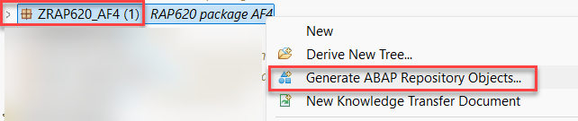

   2. In the *Select Generator* screen select the **OData UI Service from Scratch** Generator option and press **Next** 

      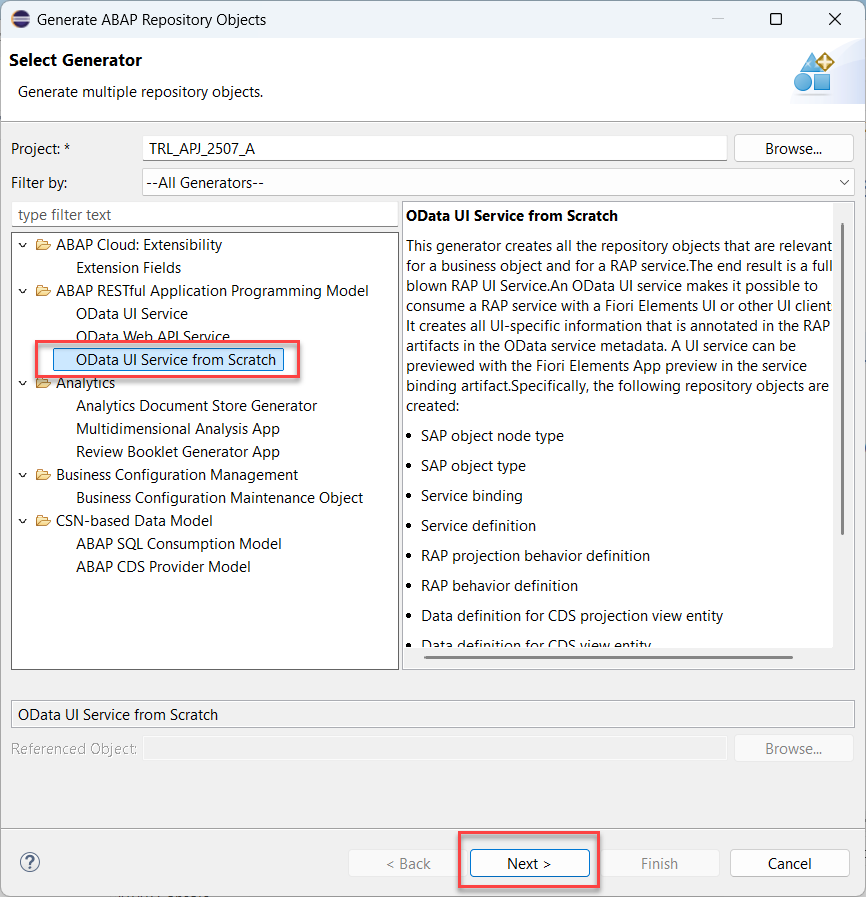

   3. In the *Enter Package* screen just press **Next**.  
      
   4. Maintain the required information on the **Configure Generator** dialog to provide the following information:  
      (1) **Artifact Suffix** please enter your group number **###**  
      (2) **Project Name** please enter **Inventory** 

      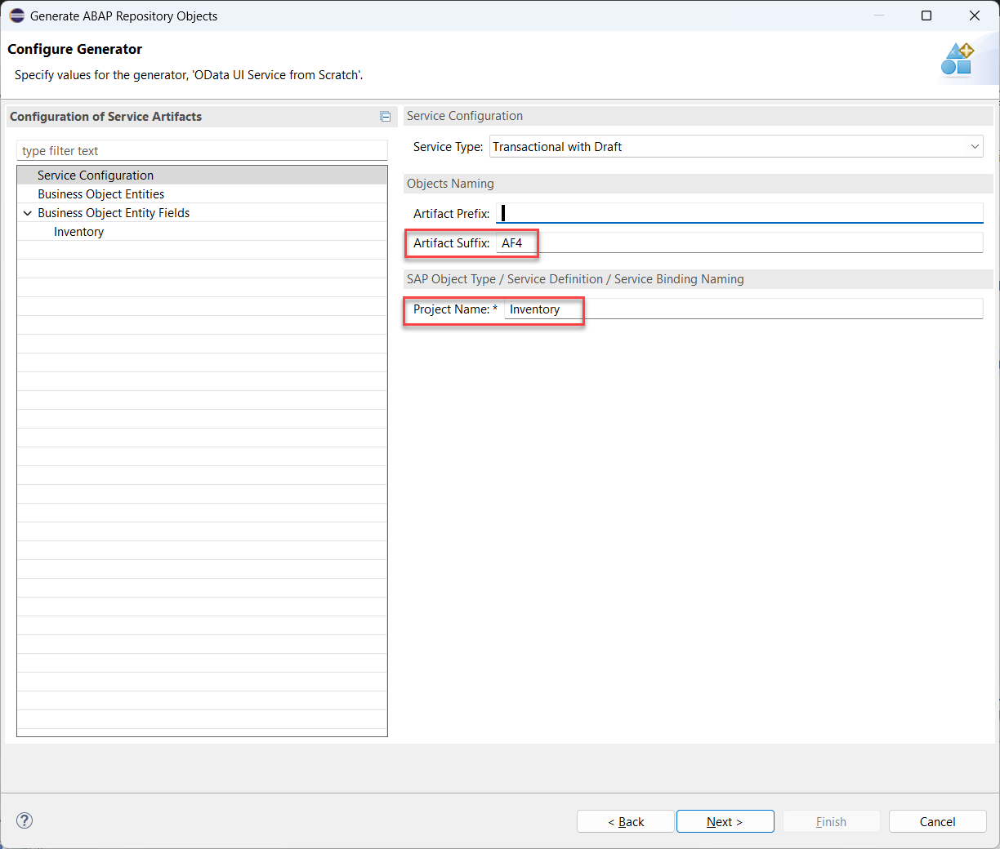

   5. Click on **Business Object Entities** sand then click on **Add**. 
   
      > This will open the **Add Business Entity** popup which allows you to search for the structure `zrap620_inventory_###` that you have created beforehand. 

      **Entity Alias**: `Inventory`  
      **Template Name**: Click on **Browse** to search for the structure `zrap620_inventory_###` 
      
      Then press **Add** and then press **Next**.

      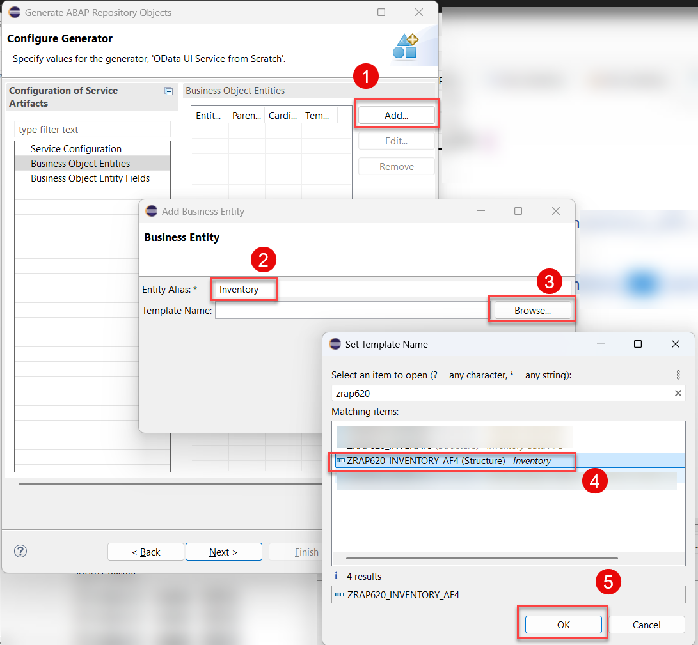  

   6. You can check the fields that will be added to your entity. Press **Next>**.   

      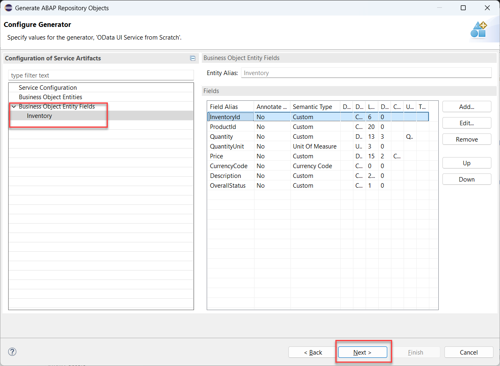  

   6. The generator will finally show a list of the objects that are going to be generated (see table below). Press **Next >**.
 
      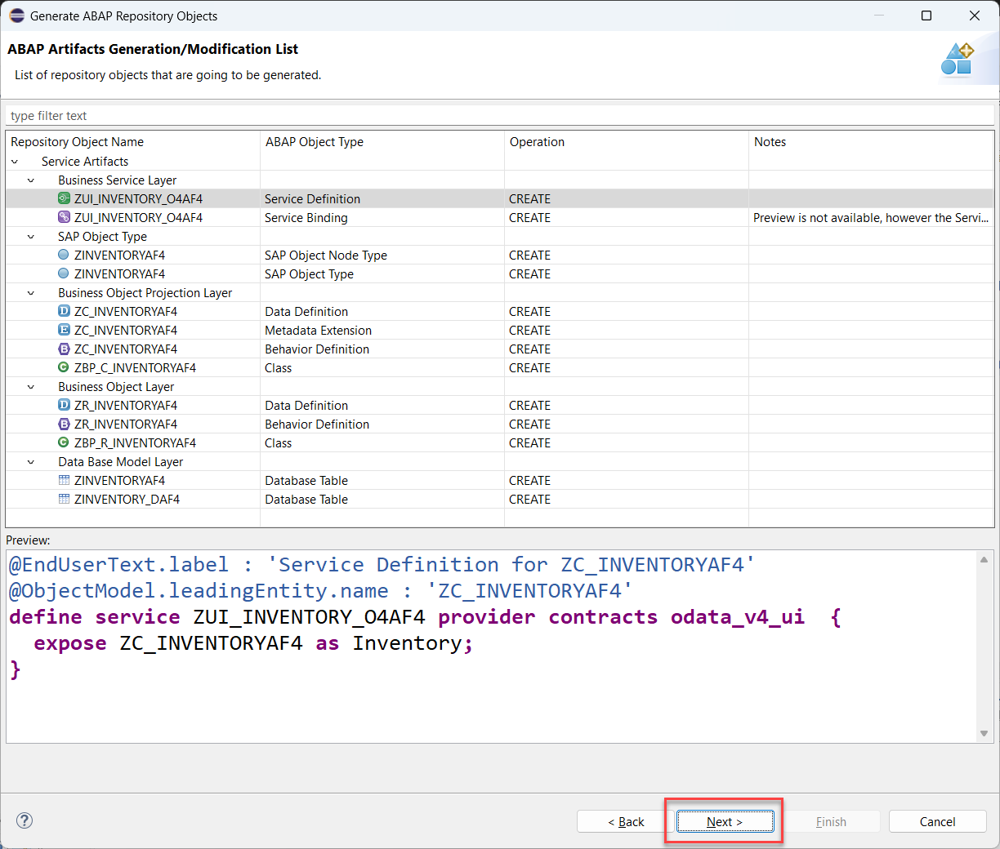
 
   6. Select a suitable transport request and press **Finish**. The needed artifacts will be generated.  

   7. When the generation process is finished the wizard offers a popup to open the generated Service Binding.   
 
      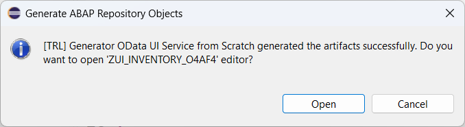
      

   8. Go to the **Project Explorer**, select your package  **`ZRAP620_###`**, refresh it by pressing **F5**, and check all generated ABAP repository objects 

       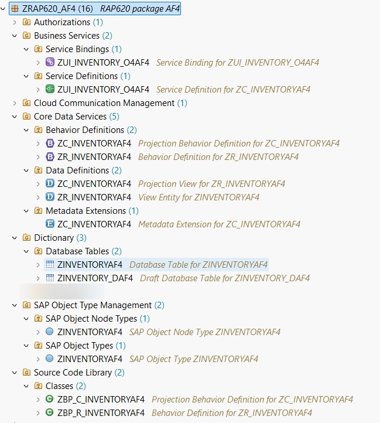
      
   Below is a brief explanation of the generated artefacts for the different RAP layers: Base BO, BO Projection, and Business Service.

---
  **Base Business Object (BO) `ZR_INVENTORY###`** 
  
   | **Object Name**               |  **Description**         |     
   |:----------------------------- |:------------------------ |
   | **`ZR_INVENTORY###`**     | (aka _Base BO view_): This **data definition** defines the data model of the root entity _Inventory_ which is the only  node of our business object).  |                      
   | **`ZR_INVENTORY###`**   | (aka _Base BO behavior**): This **behavior definition** contains the definition of the standard transactional behavior of the base _Inventory_ BO entity. It is a _managed_ and _draft-enabled_ implementation.  |  
   | **`ZINVENTORY###`**   | (aka _Active table_): This **database table** is used to store the data from _inventory_ instances at runtime. Saving the data is managed by the RAP framework.    | 
   | **`ZINVENTORY_D###`**   | (aka _Draft table_): This **database table** is used to temporary store the data from draft _inventory_ instances at runtime. It is managed by the RAP framework.    |     
   | **`ZBP_R_INVENTORY###`**  | (aka _Behavior pool_): This **ABAP class** which provides the implementation of the behavior defined in the behavior definition `ZR_INVENTORY###` of the base _Inventory_ BO.   |  
  
---
  **SAP Object Type `ZINVENTORY###`** 
  
  The SAP Object type and the SAP Object Node types are added as properties or annotations to the various repository objects that are part of the generated RAP business object. 

   | **Object Name**               |  **Description**         |     
   |:----------------------------- |:------------------------ |
   | **`ZINVENTORY###`**   | (aka _SAP Object Type_): This **SAP Object Type** is used to define that certain objects are part of the re `@ObjectModel.sapObjectNodeType.name: 'ZInventory###'`.  |           
   | **`ZINVENTORY###`**   | (aka _SAP Node Object Type_): This **SAP Object Node Type** is a type that can be created for each entity of a RAP business object. A SAP Object Node type has a 1:1 relation to the SAP Object type of the RAP BO. The name of the SAP Object Node Type of the root node must match the name of the SAP Object Type of the RAP BO  |        
  
   
---
  **Business Service** 

   | **Object Name**               |  **Description**         |     
   |:----------------------------- |:------------------------ |
   | **`ZUI_INVENTORY_O4###`**  | A service definition is used to define the relevant entity sets for our service and also to provide local aliases if needed. Only the _Inventory_ entity set is exposed in the present scenario. |                      
   | **`ZUI_INVENTORY_O4###`**  | This service binding is used to expose the generated service definition as OData V4 based UI service. Other binding types (protocols and scenarios) are supported in the service binding wizard.  |  
   
---

 

 </details>


## Exercise 1.4: Preview the Inventory App
[^Top of page](#exercise-1-generate-ui-service-from-scratch)

> Publish the local service endpoint of your service binding  **`ZUI_INVENTORY_O4###`** and start the _Fiori elements App Preview_.

 <details>
  <summary>Click to expand!</summary>

   1. Open your service binding  **`ZUI_INVENTORY_O4###`** and click **Publish**.

      > Since several repository objects are being generated through this actions this can take some time.   

      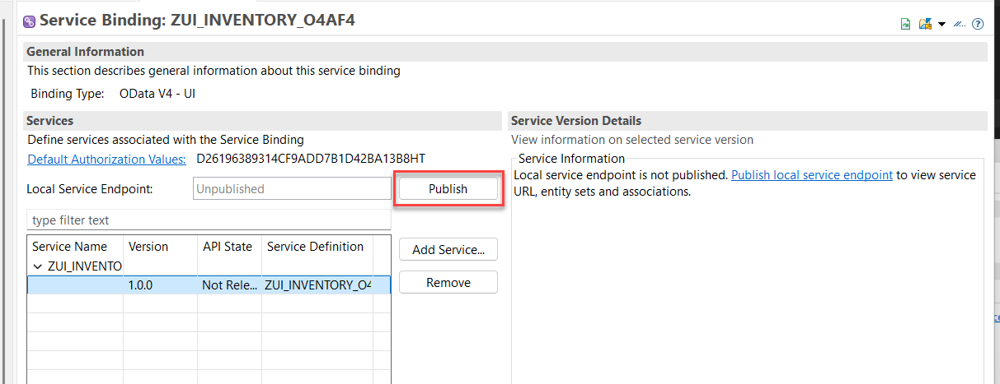
   
   2. Double-click on the entity **`Inventory`** in the **Entity Set and Association** section to open the _Fiori elements App Preview_ 
   
      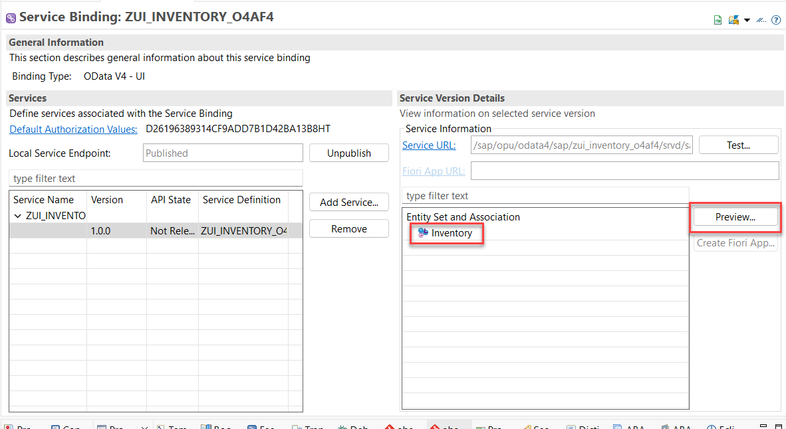

   3. Press the **Go** button.
   
      When you click the **Go** button off your _Inventory_ app you will notice that nothing is being displayed because no inventory data has been created yet. You will get the hint  
   
      _No data found._   

      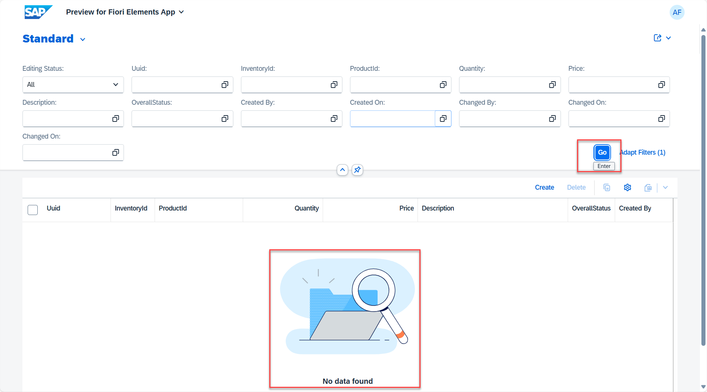  

       
   4. Press the **Create** button.

      Using the create button we can in principle create data without performing any additional implementations. 
      However, there is no business logic in place that would prevent you from entering meaningless data.  
      Also administrative fields are displayed which you would probaly not like to be displayed in a productive appliacation.
      We will fix this by removing certain `@UI.lineitem.label` and `@UI.identification.label` annotations in the following exercise  **[Exercise 2: Adapt the generated code](../ex2/README.md)**.  
      In this exercise we will also implement a determination that calculates a semantic key for the **InventoryID**.   

      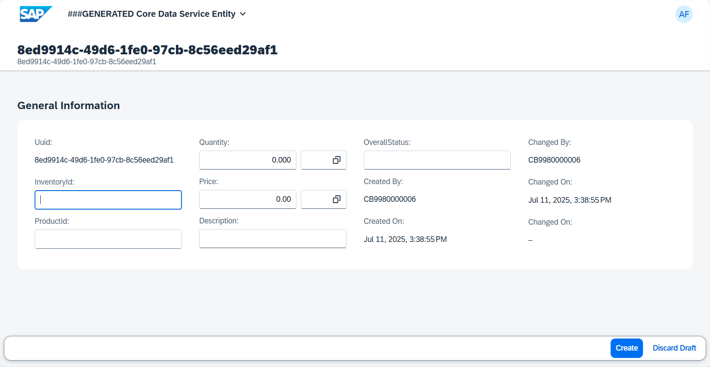

</details>

## Summary 
[^Top of page](#exercise-1-generate-ui-service-from-scratch)

Now that you've... 
- created an ABAP package,
- created a structure as a template for inventory data,
- created a transactional UI service,
- published a local service point, and started the _Fiori elements App Preview_ in ADT,

you can continue with the next exercise - **[Exercise 2: Adapt the generated code](../ex2/README.md/#adapt-the-generated-code)**.

---


