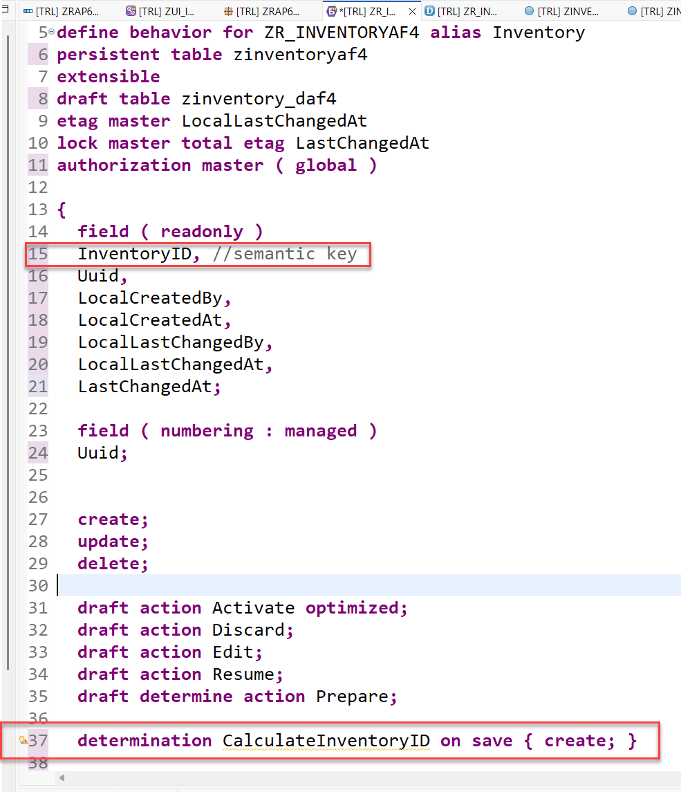
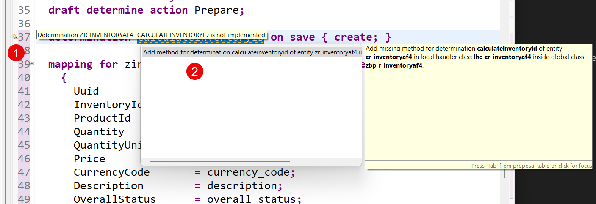
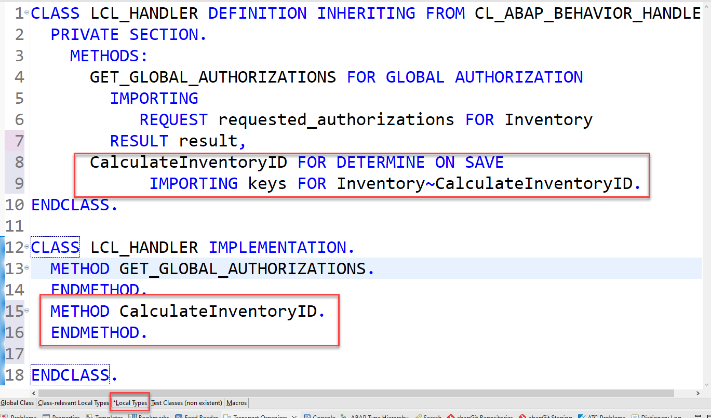
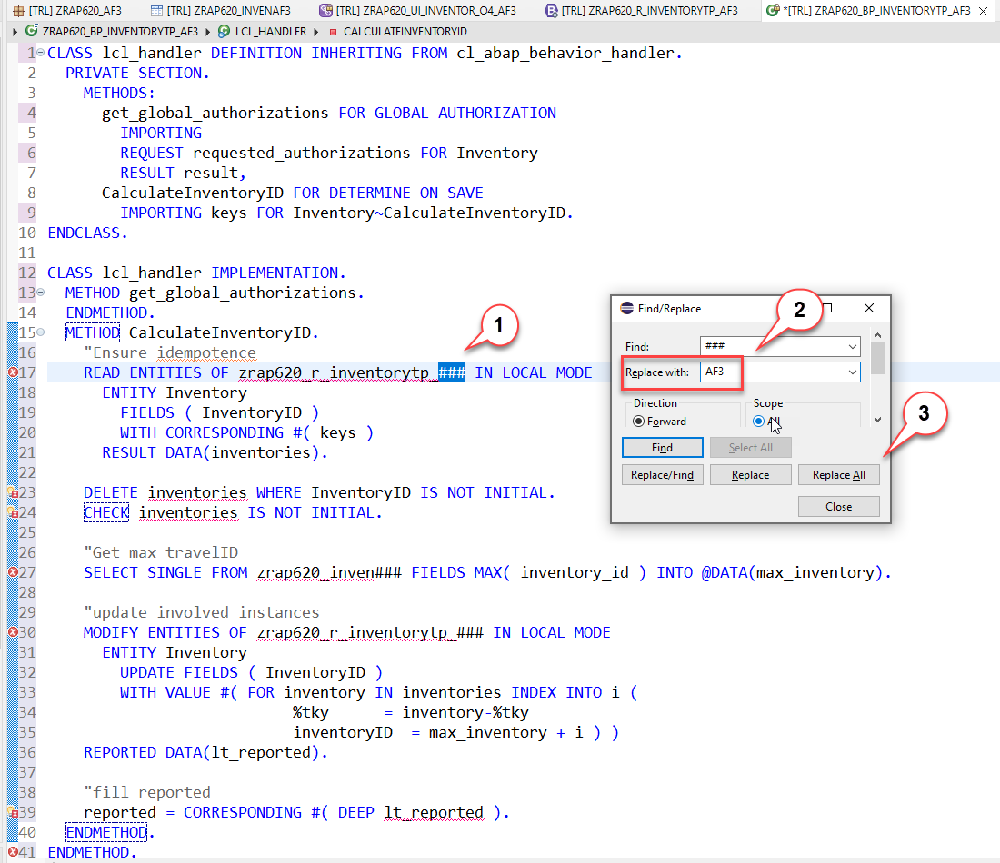
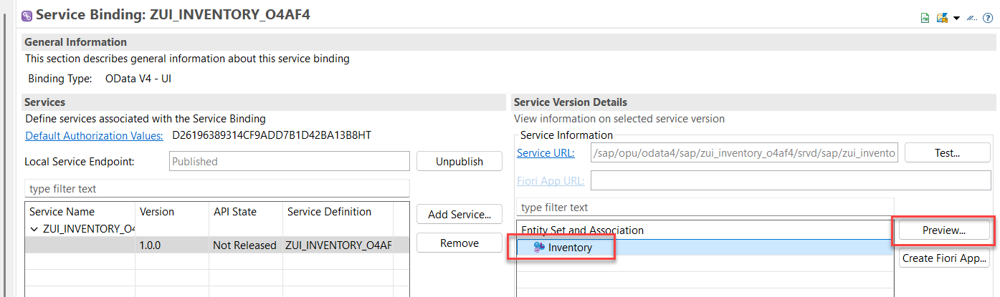
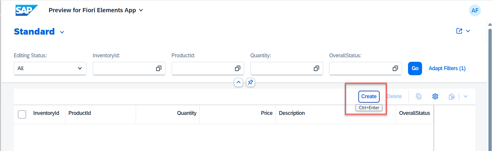
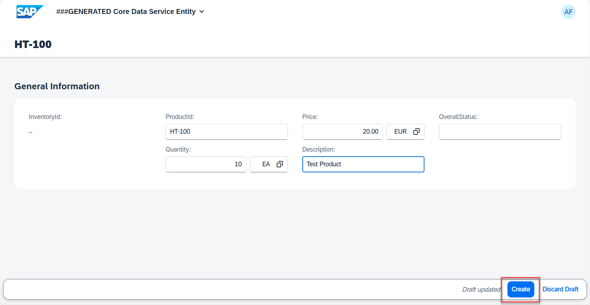
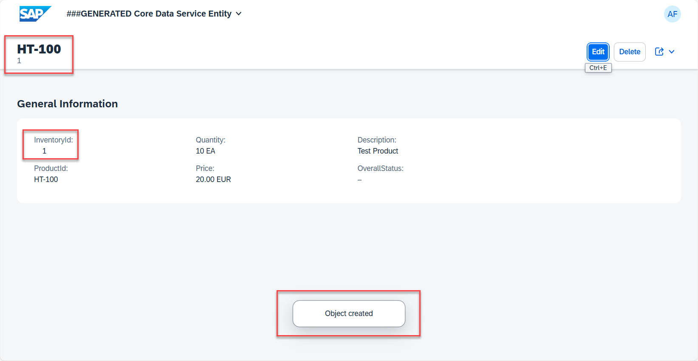

[Home - RAP620](../../#exercises)

# Exercise 2: Adapt the generated code

In this exercise we will perform changes to the generated code so that our generated application will be improved. 

- [2.1: Behavior definition](#exercise-21-behavior-definition)
- [2.2: Behavior implementation](#exercise-22-behavior-implementation)
- [2.3: Metadata Extension](#exercise-23-metadata-extension)
- [2.4: Test your changes](#exercise-24-test-your-changes)

## Exercise 2.1: Behavior definition
[^Top of page](#exercise-2-adapt-the-generated-code)   

Open the behavior defintion `ZR_INVENTORY###` and add the field **InventoryID** to the list of fields that are marked as readonly and add a determination **CalculateInventoryID** for the field **InventoryID** so that the semantic key field **InventoryID** will be filled automatically.   
 

  
Click to expand the steps ...

1. Add **InventoryID** to the list of read-only fields:

<pre>
  field ( readonly )
   InventoryID, //semantic key
   Uuid,
   LocalCreatedBy,
   LocalCreatedAt,
   LocalLastChangedBy,
   LocalLastChangedAt,
   LastChangedAt;
</pre>

2. add the following line of code right before the mapping section.

<pre>
determination CalculateInventoryID on save { create; }
</pre>

3. Save and activate your changes and proceed with the following section to maintain the behavior implementation.    

> Once you have added the determination to the behavior definition you will get a warning that the determination is not implemented yet.

## Exercise 2.2: Behavior implementation  

[^Top of page](#exercise-2-adapt-the-generated-code)   

The behavior implementation class `ZBP_R_INVENTORY###` is automatically opened with the tab **Local Types** for the local handler class `lcl_handler` .
The quick fix has added a method `CalculateInventoryID` with an (empty) implementation for the determination that shall calculate the semantic key InventoryID. 

  
Click to expand the steps ...

1. Click on the warning icon beside the **determination** statement.   

   

2. Choose the quick fix **add method for determination caculateinventoryid of entity ZR_INVENTORY###**  

   
   

3. The editor for the behavior implementation class opens.

   

4. Add the code shown below to implement the determination for the field **InventoryID**
  
   > The implementation of the behavior defintion must (for technical reasons) take place in local classes that follow the naming convention **lhc_handler** when being generated with the wizard and **lhc_\<EntityName\>** (here **lhc_Inventory**) if being generated by ADT using a quick fix.  
   > We suggest to use the source code shown below to implement the calculation of the semantic key of our managed business object for inventory data. In a productive application you would rather use a number range.  
   > To keep our implementation simple we will use the approach to simply count the number of objects that are available.   
   > By a simple increment of this number we get a semantic key which is readable by the users of our application.

 <pre lang="ABAP"> 
 
  METHOD CalculateInventoryID.
    " Ensure idempotence
    READ ENTITIES OF zr_inventory### IN LOCAL MODE
         ENTITY Inventory
         FIELDS ( InventoryID )
         WITH CORRESPONDING #( keys )
         RESULT DATA(inventories).

    DELETE inventories WHERE InventoryID IS NOT INITIAL.

    IF inventories IS INITIAL.
      RETURN.
    ENDIF.

    " Get max travelID
    SELECT SINGLE FROM zr_inventory### FIELDS MAX( inventoryid ) INTO @DATA(max_inventory).

    " update involved instances
    MODIFY ENTITIES OF zr_inventory### IN LOCAL MODE
           ENTITY Inventory
           UPDATE FIELDS ( InventoryID )
           WITH VALUE #( FOR inventory IN inventories INDEX INTO i
                         ( %tky        = inventory-%tky
                           inventoryID = max_inventory + i ) )
           REPORTED DATA(update_reported).

    " fill reported
    reported = CORRESPONDING #( DEEP update_reported ).
  ENDMETHOD.
 
</pre>
   
 5. Replace the placeholders <b>###</b> with your group number **(Ctrl+F)**.
 
 6. Activate your changes **(Ctrl+F3)**

    

## Exercise 2.3: Metadata Extension

[^Top of page](#exercise-2-adapt-the-generated-code)   

Open the metadata extension `ZC_INVENTORY###` and do the following:  

- Move the `@UI.facet` annotation to the field `Inventoryid`.
- Remove the annotations for the administrative fields and the UUID based key field.

or

Replace the generated code with the following code.

  
Click to expand the source code snippet ...

  <pre>
@Metadata.layer: #CORE
@UI.headerInfo.title.type: #STANDARD
@UI.headerInfo.title.value: 'ProductId'
@UI.headerInfo.description.type: #STANDARD
@UI.headerInfo.description.value: 'InventoryId'
annotate view ZC_INVENTORY### with
{
  @UI.facet: [ {
     label: 'General Information',
     id: 'GeneralInfo',
     purpose: #STANDARD,
     position: 10 ,
     type: #IDENTIFICATION_REFERENCE
   } ]
  @EndUserText.label: 'InventoryId'
  @UI.identification: [ {
    position: 20 ,
    label: 'InventoryId'
  } ]
  @UI.lineItem: [ {
    position: 20 ,
    label: 'InventoryId'
  } ]
  @UI.selectionField: [ {
    position: 20
  } ]
  InventoryId;

  @EndUserText.label: 'ProductId'
  @UI.identification: [ {
    position: 30 ,
    label: 'ProductId'
  } ]
  @UI.lineItem: [ {
    position: 30 ,
    label: 'ProductId'
  } ]
  @UI.selectionField: [ {
    position: 30
  } ]
  ProductId;

  @EndUserText.label: 'Quantity'
  @UI.identification: [ {
    position: 40 ,
    label: 'Quantity'
  } ]
  @UI.lineItem: [ {
    position: 40 ,
    label: 'Quantity'
  } ]
  @UI.selectionField: [ {
    position: 40
  } ]
  Quantity;

  @EndUserText.label: 'Price'
  @UI.identification: [ {
    position: 50 ,
    label: 'Price'
  } ]
  @UI.lineItem: [ {
    position: 50 ,
    label: 'Price'
  } ]
  Price;

  @EndUserText.label: 'Description'
  @UI.identification: [ {
    position: 60 ,
    label: 'Description'
  } ]
  @UI.lineItem: [ {
    position: 60 ,
    label: 'Description'
  } ]
  Description;

  @EndUserText.label: 'OverallStatus'
  @UI.identification: [ {
    position: 70 ,
    label: 'OverallStatus'
  } ]
  @UI.lineItem: [ {
    position: 70 ,
    label: 'OverallStatus'
  } ]
  @UI.selectionField: [ {
    position: 70
  } ]
  OverallStatus;
  }
  </pre>

  

## Exercise 2.4: Test your changes

After having performed all the changes mentioned above we can use the SAP Fiori Elements preview in ADT to test our updated implementation.   

  
Click to expand the steps ...

1. Open the service binding **`ZRAP620_UI_INVENTOR_O4_###`**
2. Start the SAP Fiori elements preview.
   - Select the entity set **Inventory**  
   - Press the **Preview** button 

   

3. Test the implementation. 
  - Press the **Create** button.
  - Enter an arbritray productid, a price and a quantity.
  - Press **Create**
  
    
    
  
2. Check the numbering for the semantic key **InventoryID**.

 
   
 

   

You can now continue with the next exercise  **[Exercise 3: Consume a remote API based on an OData service](../ex3/README.md)**.   
