# Exercise 3: Consume a remote API based on an OData service
[Home - RAP620](../../#exercises)

## Introduction

In this exercise you will learn how to consume an OData Service from an SAP S/4HANA public cloud system.

The data will be used to build a value help to fetch product master data for the Inventory entity using the **Product Master Data Including Classification - Read** - Service.

In this exercise, you will ...

- [3.1. - Create a Service Consumption Model for the Product Master Data Including Classification - Read Service](#exercise-31-create-the-service-consumption-model)
  - [3.1.1 Download Metadata from the SAP Business Accelerator Hub](#exercise-311-download-metadata-from-the-sap-business-accelerator-hub)
  - [3.1.2 Generate the Service Consumption Model](#exercise-312-generate-the-service-consumption-model)          

- [3.2. - Create a console application to test the OData Service](#exercise-32-create-a-console-application-to-test-the-odata-service)
  

- [3.3. - Create a custom entity and implement the query implementation class](#exercise-33-create-a-custom-entity-and-implement-the-query-implementation-class)
  - [3.3.1 - Create a custom entity](#exercise-331-create-a-custom-entity)
  - [3.3.2 - Implement the query implemenation class](#exercise-332-implement-the-query-implemenation-class)   

- [3.4. - Add the custom entity to your Service Defintion](#exercise-34-add-the-custom-entity-to-your-service-definition)
- [3.5. - Add the custom entity as a value help](#exercise-35-add-the-custom-entity-as-a-value-help)
- [3.6. - Test the service](#exercise-36-test-the-service)
- [Summary](#summary) 

When creating a new entry with your inventory application you see that there is no value help for the field **ProductId**. 
Since this information resides in a SAP S/4 HANA public cloud backend we will retrieve it retrieve via OData.

 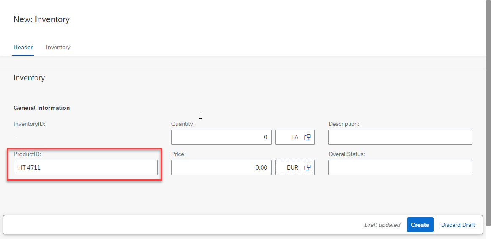

> **Please note:**
>  
> In order to be able to build such a side-by-side extension on the SAP BTP ABAP Environment trial systems which are shared systems we have to use pre-configured communication arrangements that allow us to consume OData services in a shared SAP S/4HANA Cloud Demo System that has been setup as a demo backend system for the SAP BTP trial.

## Exercise 3.1: Create the Service Consumption Model
[^Top of page](#exercise-3-consume-a-remote-api-based-on-an-odata-service)    

In this step we will generate a so called **Service Consumption Model**. This type of object takes an external interface description as its input. Currently *OData*, *SOAP* and *RFC* are supported.  

Based on the information found in the *$metadata* file or the *wsdl* file appropriate repository objects are generated (OData Client proxy or SOAP proxy objects). For services that are available in SAP S/4HANA systems this information can be downloaded from the **SAP Business Accelerator Hub**.    

For RFC function modules the metadata file is created in the backend using the transaction *ACO_PROXY*.  

Using these objects you will be able to write ABAP code that lets you consume remote OData services, SOAP services or RFC function modules.

> ⚠️ Please note
> The shared SAP S/4HANA public cloud demo system that is used in this case only allows to use a few services that are part of this demo scripts. In order to have access to a full blown SAP S/4HANA public cloud system please check out this [link](https://www.sap.com/products/erp/s4hana/trial.html).    

Click to expand

We start by creating a service consumption model for an OData service that provides demo product data. This service resides on a shared SAP S/4HANA public cloud demo system. The connectivity based on a so called communication arrangement has been preconfigured in all shared SAP BTP ABAP Environment systems for your convenience. 

### Exercise 3.1.1: Download metadata from the SAP Business Accelerator Hub
[^Top of page](#exercise-3-consume-a-remote-api-based-on-an-odata-service)  

1. The *$metadata* file of the OData service that we want to consume must be uploaded in file format. You have hence to download it first.

2. Navigate to the overview page of the [Product Master Data Including Classification - Read - Service](https://api.sap.com/api/API_CLFN_PRODUCT_SRV/overview).

   Click on the tab **API Specification**.  

3. Click on the download button for the **OData EDMX** file and store the file **API_CLFN_PRODUCT_SRV.edmx** locally on your computer. 

   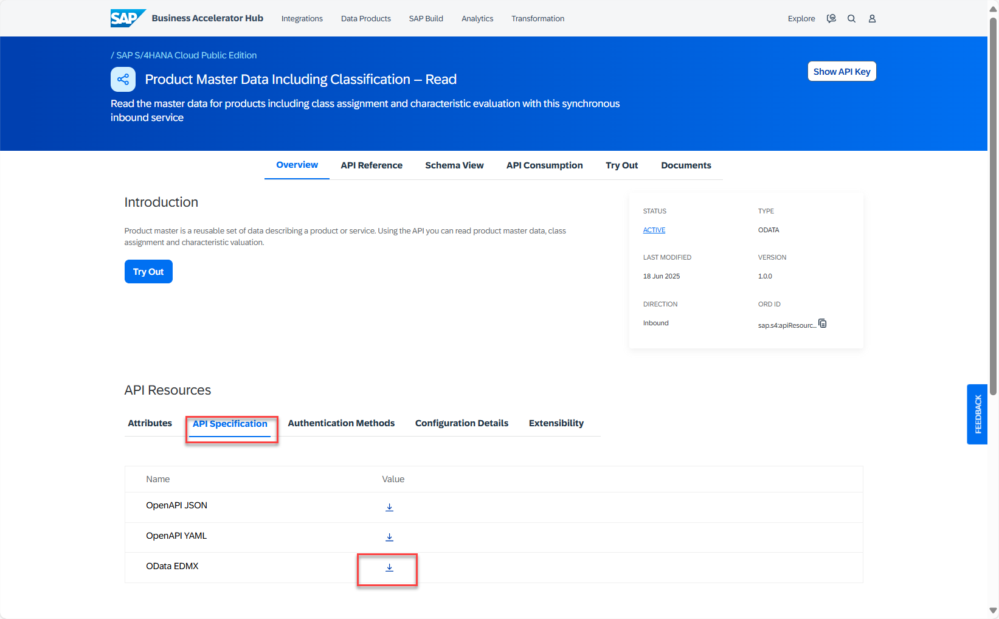.
   

   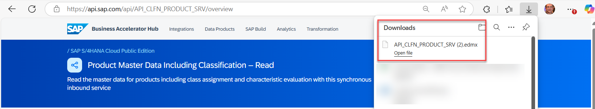.

### Exercise 3.1.2: Generate the Service Consumption Model      
[^Top of page](#exercise-3-consume-a-remote-api-based-on-an-odata-service)  

1. Switch to ADT and right click on your package **ZRAP620_###**. Select **New > Other ABAP Repository Object**.  

    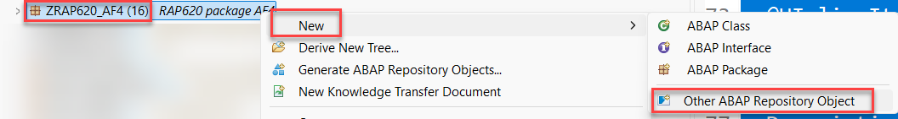  

2. In the **New ABAP Repository Object** dialogue do the following

   -  Start to type **`Service`**
   -  In the list of objects select **Service Consumption Model**
   -  Click **Next**
 
      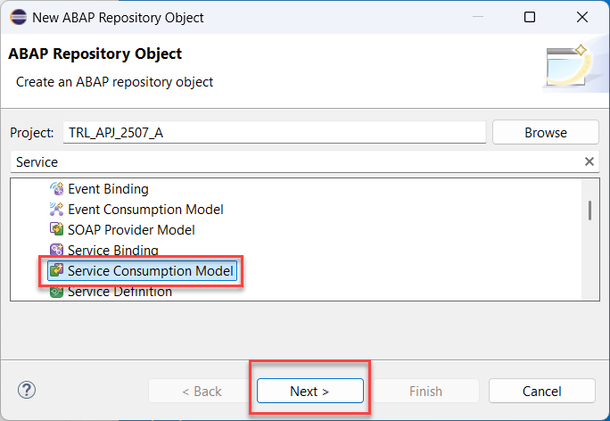

3. The **New Service Consumption Model** dialogue opens. Here enter the following data:

   - Name: **`ZSC_PRODUCTS_###`**
   - Description: **`Products from S4`**
   - Remote Consumption Model: **`OData`** (to be selected from the drop down box)
   
   Then click **Next**. 
   
   > **Caution**
   
   > Be sure that you have selected **`OData`** as the **Remote Consumption Mode** from the drop down box. We will create a service consumption model for a SOAP web service in the following exercise.
   
    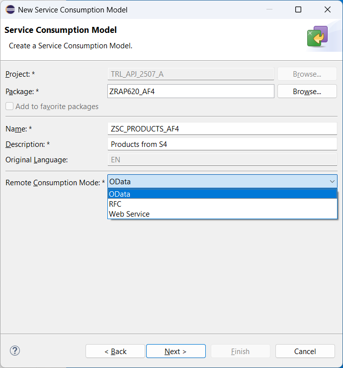

4. The $metadata file of the OData service that we want to consume must be uploaded in file format. If you have not yet downloaded the $metadata file you have to do this now.

   - Click **Browse** to select the $metadata file **API_CLFN_PRODUCT_SRV.edmx** that you have downloaded earlier in this exercise
   - Class Name: **`ZRAP620_SC_PRODUCTS_###`**    
   
> **Please note**
> The wizard suggest the name of the service consumption model also as the name of the class that is going to be generated. Leave the defaulted value.

 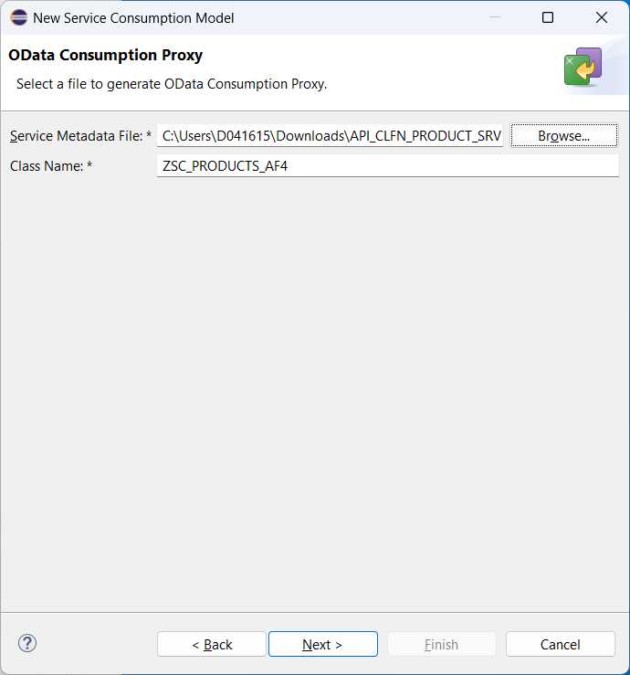

5. Check the **Components of the OData Service** and click **Next**.

   You will notice that the **Product Master Data Including Classification - Read - Service** provides several entity sets and several entity types, e.g. `A_ClfnProduct` and `A_ClfnProductType`. 

   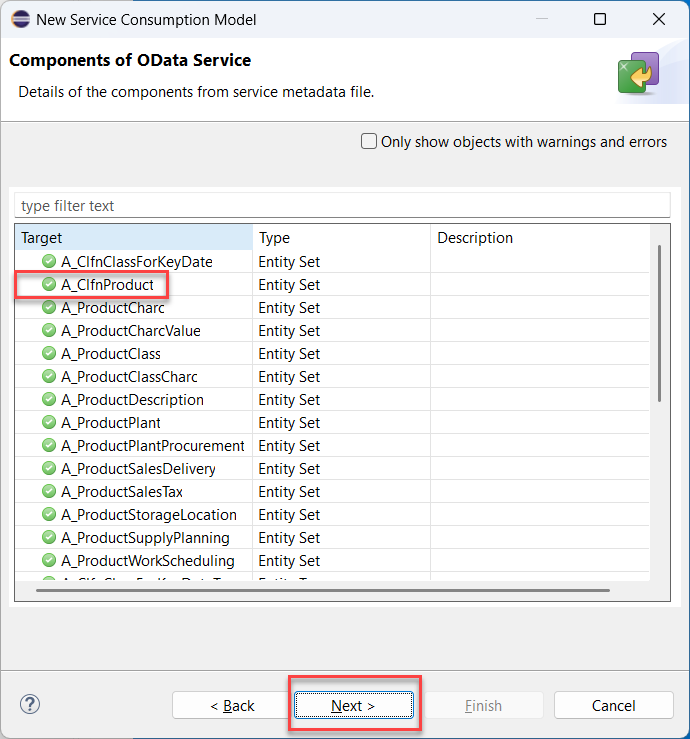

   Press **Next**.

6. The wizard will now let you choose for which entity sets support for etags should be added. We will not use this feature, since access to the service is just read-only as a value help.  

   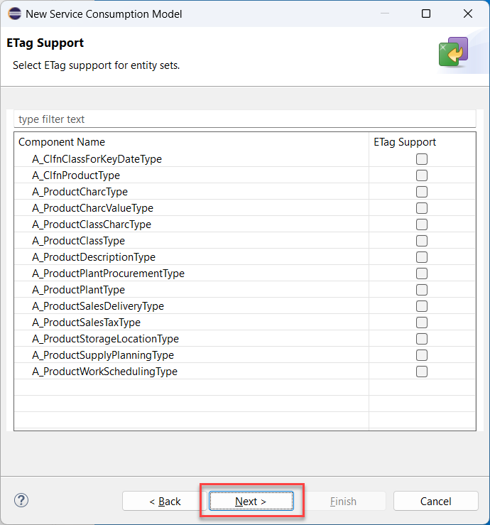

   Press **Next**.

7. Selection of transport request
   - Select or create a transport request
   - Press **Finish**
  

8. When you check the content of your package you will notice that it contains two new objects. 

    -  The service consumption model
    -  The service consumption model class

    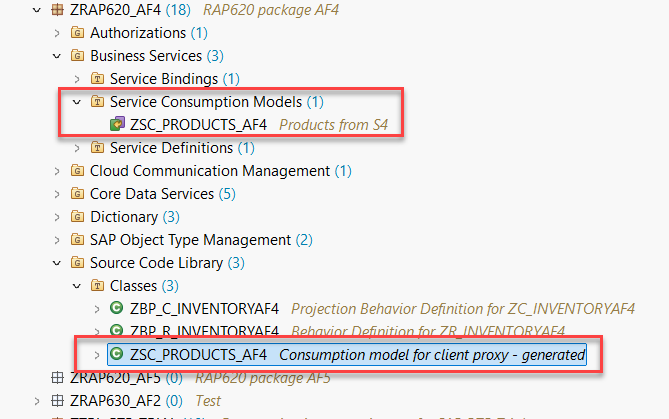

9. Select the Service Consumption Model and press the **Activate** button press or **Ctrl+F3**

10. Let us briefly investigate the service consumption model.  

   For each entity e.g. `A_ClfnProduct` and each operation (**Read List**, **Read**, **Create**, **Update** and **Delete**) some sample code has been created that you can use when you want to call the OData Service with one of these operations. Since we want to retrieve a list of Product-IDs, we will select the operation **Read List** and click on the button **Copy to Clipboard**. We will use this code in the following step where we create a console application to test the call to the remote OData service. 
  
 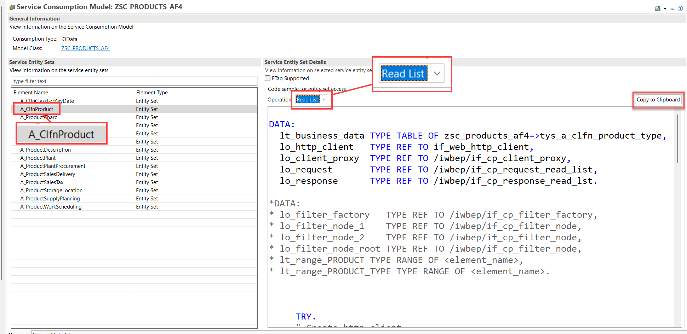

## Exercise 3.2: Create a console application to test the OData service
[^Top of page](#exercise-3-consume-a-remote-api-based-on-an-odata-service)  

We can now test the service consumption model by creating a small console application `ZCL_CE_PRODUCTS_###` that implements the interface `if_oo_adt_classrun`. 
This is a useful additional step since this way it is easier to check whether the OData consumption works and debugging a console application is much easier than trying out your coding in the full fledged RAP business object.

> **Please note**
> We will use this class at a later stage also as an implementation for our custom query and we hence choose a name `ZRAP620_CL_CE_PRODUCTS_###` that already contains the name of the to be created custom entity. `CE` denotes that this class will act as a query implementation for a *Custom Entity*.

Click to expand

1. Right click on your package `ZRAP620_###` and select **New > ABAP Class**.

2. The **New ABAP class** dialogue opens. Here you have to enter the following:

   - Name: `ZCL_CE_PRODUCTS_###`
   - Description: `Query implementation custom entity` 
   - Click **Add**
   
   The **Add ABAP Interface** dialogue opens.
   
   - Start to type `if_oo`
   - Select `IF_OO_ADT_CLASSRUN` from the list of matching items
   - Press **OK** or double-click on `IF_OO_ADT_CLASSRUN`  
   
3. Check the input and press **Next**  

   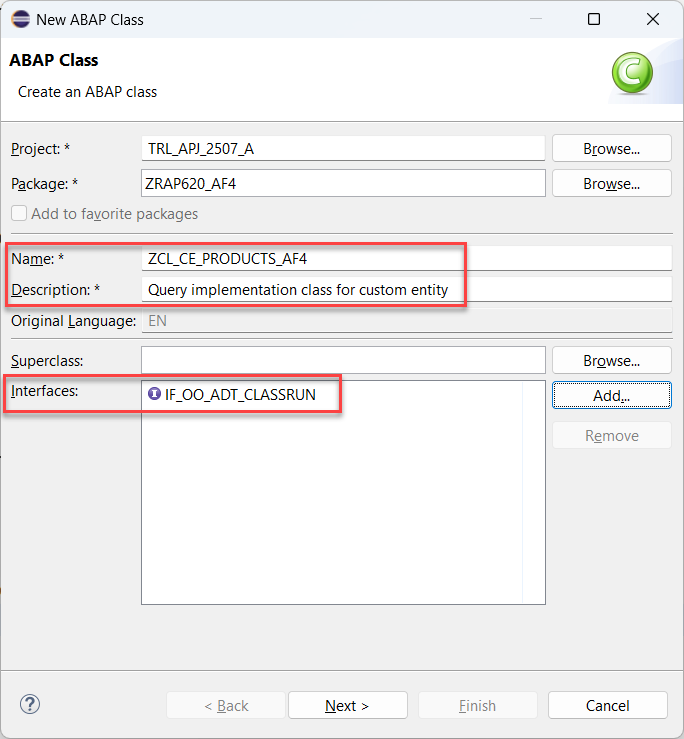

4. Selection of transport request

   - Select or create a transport request
   - Click **Finish**
  
5. Check the source code template

  You will notice that the wizard has automatically added an implementation for the method `IF_OO_ADT_CLASSRUN~MAIN`. 

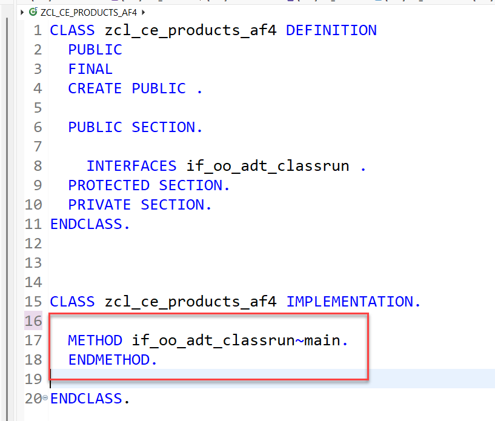

### Implementation
[^Top of page](#exercise-3-consume-a-remote-api-based-on-an-odata-service)  

1. Let's start with the implementation of our test class. 

   In the public section we add two `TYPES` definitions. `t_product_range` is used to provide filter conditions for ProductIDs in form of `SELECT-OPTIONS` to the method `get_products( )`.    
   The second type `t_business_data` is used to retrieve the business data returned by our remote OData service.  
   For both type defintions we reuse the public types definitions of our newly generated Service Consumption Model class **`zrap620_sc_products_###`**.  
   The  `get_products( )` method takes filter conditions in form of `SELECT-OPTIONS` via the importing parameter `it_filter_cond`. In addition it is possible to provide values for `top` and `skip` to leverage client side paging.  

   So the `DEFINITION` section of your class should now look like follows:

   <pre>

CLASS zcl_ce_products_### DEFINITION
  PUBLIC
  FINAL
  CREATE PUBLIC .

  PUBLIC SECTION.
    INTERFACES if_oo_adt_classrun.

    TYPES t_product_range TYPE RANGE OF zsc_products_###=>tys_a_clfn_product_type.
    TYPES t_business_data TYPE zsc_products_###=>tyt_a_clfn_product_type.

    METHODS get_products
      IMPORTING filter_conditions TYPE if_rap_query_filter=>tt_name_range_pairs OPTIONAL
                !top              TYPE i                                        OPTIONAL
                !skip             TYPE i                                        OPTIONAL
      EXPORTING business_data     TYPE t_business_data
      RAISING   /iwbep/cx_cp_remote
                /iwbep/cx_gateway
                cx_web_http_client_error
                cx_http_dest_provider_error.

  PROTECTED SECTION.
  PRIVATE SECTION.
ENDCLASS.

   </pre>

   You will get a warning that the method **get_products( )** has not been implemented yet. Press **Ctrl+1** to start the quick fix to add an implementation for **get_products( )**.

   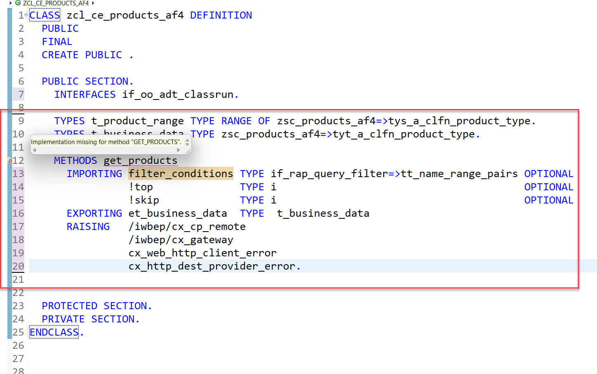

2. Now we will add code in the **IMPLEMENTATION** section of the method **get_products( )**. 

   The public method **get_products( )** is used to retrieve the data from the remote OData service. Since preconfigured communication arrangements have been provided in the trial systems, we will use the method **cl_http_destination_provider=>create_by_comm_arrangement** which allows us to create a http destination object based on the aforementioned communication arrangement. 
   
   <!-- As the target URL we choose the root URL https://sapes5.sapdevcenter.com of the ES5 system since the relative URL that points to the OData service will be added when creating the OData client proxy.-->

   **Caution:**  
   Do not forget to replace the placeholder **'###'** with your unique number.  

   > Please note
   > In a normal SAP BTP ABAP Environment system one would have to create an communication scenario and a communication arrangement to consume the product classification OData service from your own SAP S/4HANA public cloud system.

   <pre>

 METHOD get_products.
    DATA filter_factory     TYPE REF TO /iwbep/if_cp_filter_factory.
    DATA filter_node        TYPE REF TO /iwbep/if_cp_filter_node.
    DATA root_filter_node   TYPE REF TO /iwbep/if_cp_filter_node.

    DATA http_client        TYPE REF TO if_web_http_client.
    DATA odata_client_proxy TYPE REF TO /iwbep/if_cp_client_proxy.
    DATA read_list_request  TYPE REF TO /iwbep/if_cp_request_read_list.
    DATA read_list_response TYPE REF TO /iwbep/if_cp_response_read_lst.

    DATA(http_destination) = cl_http_destination_provider=>create_by_comm_arrangement(
                                 comm_scenario = 'ZBTP_TRIAL_SAP_COM_0309' ).

    http_client = cl_web_http_client_manager=>create_by_http_destination( http_destination ).

    odata_client_proxy = /iwbep/cl_cp_factory_remote=>create_v2_remote_proxy(
                             is_proxy_model_key       = VALUE #( repository_id       = 'DEFAULT'
                                                                 proxy_model_id      = 'ZSC_PRODUCTS_###'
                                                                 proxy_model_version = '0001' )
                             io_http_client           = http_client
                             iv_relative_service_root = '' ).

    " Navigate to the resource and create a request for the read operation
    read_list_request = odata_client_proxy->create_resource_for_entity_set( 'A_CLFN_PRODUCT' )->create_request_for_read( ).

    " Create the filter tree
    filter_factory = read_list_request->create_filter_factory( ).
    LOOP AT filter_conditions INTO DATA(filter_condition).
      filter_node = filter_factory->create_by_range( iv_property_path = filter_condition-name
                                                     it_range         = filter_condition-range ).
      IF root_filter_node IS INITIAL.
        root_filter_node = filter_node.
      ELSE.
        root_filter_node = root_filter_node->and( filter_node ).
      ENDIF.
    ENDLOOP.

    IF root_filter_node IS NOT INITIAL.
      read_list_request->set_filter( root_filter_node ).
    ENDIF.

    IF top > 0.
      read_list_request->set_top( top ).
    ENDIF.

    read_list_request->set_skip( skip ).

    " Execute the request and retrieve the business data
    read_list_response = read_list_request->execute( ).
    read_list_response->get_business_data( IMPORTING et_business_data = business_data ).
  ENDMETHOD.

   </pre>

8. Finally we add the following code into the **IMPLEMENTATION** section of your **main** method

   The main method creates a simple filter for products with a name greater or equal **TG11**. At the same time we use client side paging to skip the first result and limit the response to 3 products.

   <pre>
  METHOD if_oo_adt_classrun~main.

    DATA business_data     TYPE t_business_data.
    DATA filter_conditions TYPE if_rap_query_filter=>tt_name_range_pairs.
    DATA ranges_table      TYPE if_rap_query_filter=>tt_range_option.

    ranges_table = VALUE #( (  sign = 'I' option = 'GE' low = 'TG-11' ) ).
    filter_conditions = VALUE #( ( name = 'PRODUCT'  range = ranges_table ) ).

    TRY.
        get_products( EXPORTING filter_conditions = filter_conditions
                                top               = 3
                                skip              = 1
                      IMPORTING business_data     = business_data ).
        out->write( business_data ).
      CATCH cx_root INTO DATA(exception).
        out->write( cl_message_helper=>get_latest_t100_exception( exception )->if_message~get_longtext( ) ).
    ENDTRY.
  ENDMETHOD.
   </pre>

9. You can now run the console application by pressing **F9**.

    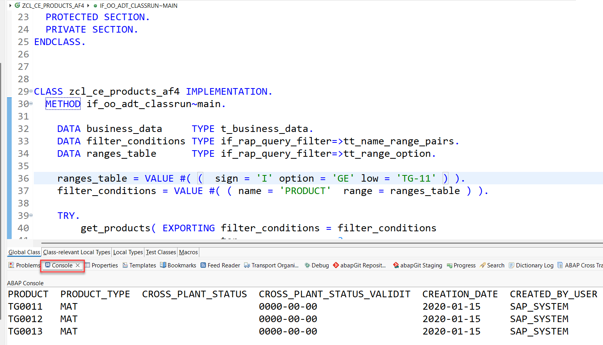

## Exercise 3.3: Create a custom entity and implement the query implementation class
[^Top of page](#exercise-3-consume-a-remote-api-based-on-an-odata-service)  

Since we want to use the results of the remote OData service in our managed inventory app we will create a custom entity. 
The syntax of a custom entity differs from the one used in normal CDS views but is very similar to the syntax of an abstract entity, table or a structure.

In order to leverage the remote OData service in our application we have to perform two steps.

1.	We have to create a custom entity. 
2.	We have to create a class that implements the query for the custom entity. (Here we will reuse the class that we have created earlier and that we have used to test the remote OData service).

Click to expand

### Exercise 3.3.1: Create a custom entity
[^Top of page](#exercise-3-consume-a-remote-api-based-on-an-odata-service)  

In contrast to "normal" CDS views that read data from the database from tables or other CDS views _custom entities_ act as a wrapper for a code based implementation that provides the data instead of a database table or a CDS view. 

The custom entity has to be created manually and it uses a similar syntax as the abstract entity that has been created when we have created our service consumption model.

In order to be able to retrieve the data from the remote OData service we have to built a class that implements the interface **if_rap_query_provider**. We will reuse the class that we have created earlier and add this interface to it.

The interface **if_rap_query_provider interface** only offers one method which is called **select**. Within this select method we will call the public **get_products( )** method. The select method also expects that the incoming requests provide certain OData specific query parameters. These we will set in our coding as well.

Let’s start with creating a new data definition `ZCE_PRODUCTS_###` using the template for a custom entity.

1. Right-click on the folder **Data Definition** and select **New Data Definition.**   

   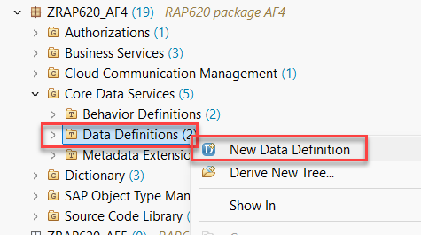

2. The **New Data Defintion** dialogue opens. Here you have to enter the following values:  
   - Name: **`ZCE_PRODUCTS_###`** 
   - Description: **`Custom entity for products from S4`**
   
   Press **Next**
   
   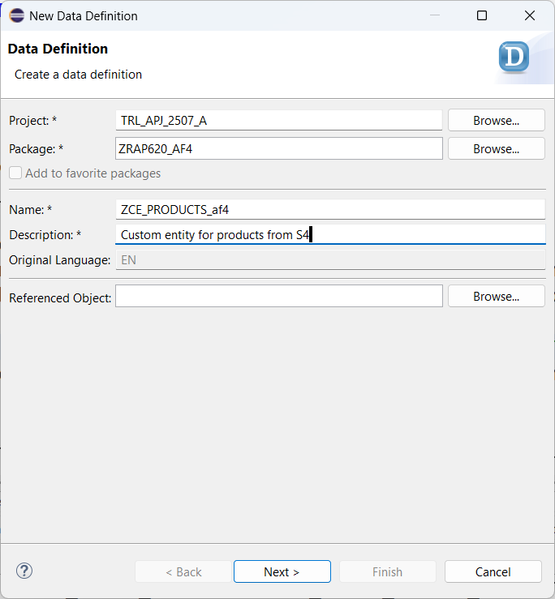
   
3. Selection of a transport request
   - Select or create a transport request.
   - **!!! ONLY !!!** Press *Next*. Do **NOT** press *Finish*.

   > ⚠️⚠️⚠️ Caution  
   > If you were to press **Finish** instead of **Next**, the wizard would use the template that was used the last time when this wizard was used by the developer.   
   > In order to be sure that the correct template is selected, we **MUST** press **Next** and not **Finish** which would skip the step of template selection.

   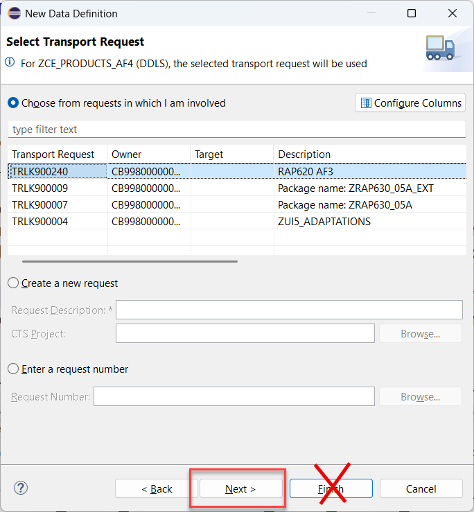

4. Select Template

   - Use the scroll bar to navigate down the list
   - Select the template **Define custom entity with parameters**
   - Press **Finish**

> **Please note**

> There is only a template for a custom entity with parameters. But this doesn’t matter. We use this template and remove the statement `with parameters parameter_name : parameter_type`.

 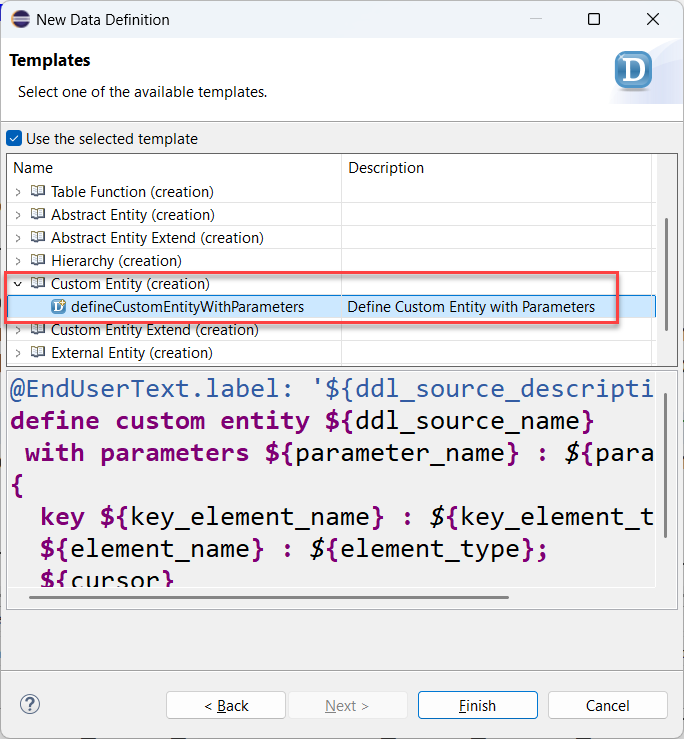

 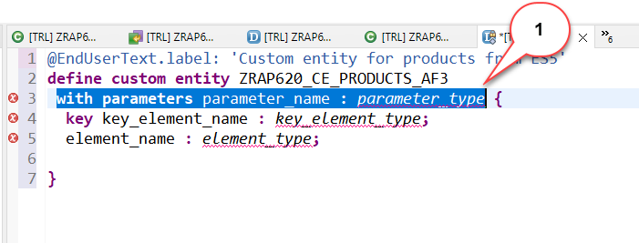

5. Edit the source code of the custom entity

   - From the remote OData service that is used by the service consumption model we only use the following three fields for your value help: `Product`, `ProductType` and `ProductGroup`.
   - We add the annotation `@ObjectModel.query.implementedBy: 'ABAP:ZCL_CE_PRODUCTS_###'` right before the `define custom entity` statement.

    The DDL source code should now look like follows:  

   <pre>
@EndUserText.label: 'Custom entity for products from S4'
@ObjectModel.query.implementedBy: 'ABAP:ZCL_CE_PRODUCTS_###'
define custom entity ZCE_PRODUCTS_###
// with parameters parameter_name : parameter_type
{
  key Product             : abap.char( 40 );
      //Property name must not be ProductType 
      ProductTypeName         : abap.char( 4 );
      ProductGroupName        : abap.char( 9 );  
 
}

   </pre>

   [Source code ZCE_PRODUCTS_###](sources/ex2_DDLS_ZCE_RAP_PRODUCTS_%23%23%23%23.txt)

7. Activate your changes 

> You might get the warning that the class ` ZCE_PRODUCTS_###` is not found. This is because our class does not yet implement the interface `IF_RAP_QUERY_PROVIDER`.  

### Exercise 3.3.2: Implement the query implemenation class
[^Top of page](#exercise-3-consume-a-remote-api-based-on-an-odata-service)  

After having created the custom entity `ZCE_PRODUCTS_###` we now have to enhance the query implementation class `ZCE_PRODUCTS_###` that we have created earlier in this exercise.

1. Add interface **`IF_RAP_QUERY_PROVIDER`** to the query implementation class **`ZCL_CE_PRODUCTS_###`**
 
   - You can use the quick fix `Ctrl+1` to add the implementation for the method `if_rap_query_provider~select`
  
   <pre>
  INTERFACES if_rap_query_provider.
   </pre>
  
  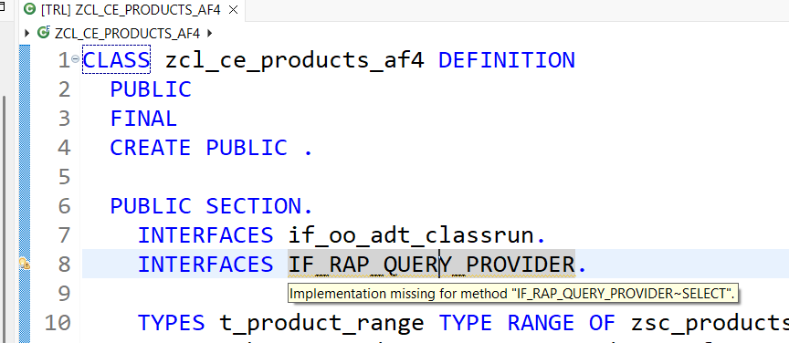
  
2. Add the following types statement

   <pre>
  TYPES t_business_data_external TYPE TABLE OF zce_products_###.
   </pre>

2. Implement the method  `if_rap_query_provider~select`  
  
   Within the `select()` method we can retrieve the details of the incoming OData call using the object `io_request`. Using the method `get_paging()` we can find out whether client side paging was requested with the incoming OData call. Using the method `get_filter()` we can retrieve the filter that was used by the incoming OData request as ranges. This comes in handy so we can provide this data when calling the method `get_products()`.

   > **Please note:**
   > It is mandatory that the response not only contains the retrieved data via the method `set_data()` but also the number of entities being returned via the method `set_total_number_of_records()`.

   [Source code zcl_ce_rap_products_####](sources/ex2_CLAS_zcl_ce_rap_products_%23%23%23%23_step_2.txt)

  <pre>

  METHOD if_rap_query_provider~select.
    DATA business_data          TYPE t_business_data.
    DATA business_data_external TYPE t_business_data_external.

    DATA(top)  = io_request->get_paging( )->get_page_size( ).
    DATA(skip) = io_request->get_paging( )->get_offset( ).   
    DATA(requested_fields) = io_request->get_requested_elements( ).
    DATA(sort_order) = io_request->get_sort_elements( ).

    TRY.
        DATA(filter_condition) = io_request->get_filter( )->get_as_ranges( ).

        get_products( EXPORTING filter_conditions = filter_condition
                                top               = CONV i( top )
                                skip              = CONV i( skip )
                      IMPORTING business_data     = business_data ).

        business_data_external = CORRESPONDING #( business_data
                                          MAPPING Product = product
                                                  ProductType = product_type
                                                  ProductGroup = product_group ).

        io_response->set_total_number_of_records( lines( business_data_external ) ).
        io_response->set_data( business_data_external ).

      CATCH cx_root INTO DATA(exception).
        " TODO: variable is assigned but never used (ABAP cleaner)
        DATA(exception_message) = cl_message_helper=>get_latest_t100_exception( exception )->if_message~get_longtext( ).
    ENDTRY.
  ENDMETHOD.

 
  </pre>

3. Activate your changes 

### Hints for creating the custom entity based on the type **`tys_sepmra_i_product_etype`**   
[^Top of page](#exercise-3-consume-a-remote-api-based-on-an-odata-service)  

In the above code sample we just added three fields to our custom entity.

When checking the source code of the *Service Consumption Provider Model* class we find in the public section the type defintion **`tys_a_clfn_product_type`** which contains the ABAP internal representation of the data and a corresponding type **`tyt_a_clfn_product_type`** for storing this data as a table.

  
<pre>
  TYPES:
      "! 
A_ClfnProductType

      BEGIN OF tys_a_clfn_product_type,
        "! <em>Key property</em> Product
        product                    TYPE c LENGTH 40,
        "! ProductType
        product_type               TYPE c LENGTH 4,
        "! CrossPlantStatus
        cross_plant_status         TYPE c LENGTH 2,
        "! CrossPlantStatusValidityDate
        cross_plant_status_validit TYPE datn,
        "! CreationDate
        creation_date              TYPE datn,
        "! CreatedByUser
        created_by_user            TYPE c LENGTH 12,
        "! LastChangeDate
        last_change_date           TYPE datn,
        "! LastChangedByUser
        last_changed_by_user       TYPE c LENGTH 12,
        "! IsMarkedForDeletion
        is_marked_for_deletion     TYPE abap_bool,
        "! ProductOldID
        product_old_id             TYPE c LENGTH 40,
        "! GrossWeight
        gross_weight               TYPE p LENGTH 7 DECIMALS 3,
        "! PurchaseOrderQuantityUnit
        purchase_order_quantity_un TYPE c LENGTH 3,
        "! SourceOfSupply
        source_of_supply           TYPE c LENGTH 1,
        "! WeightUnit
        weight_unit                TYPE c LENGTH 3,
        "! NetWeight
        net_weight                 TYPE p LENGTH 7 DECIMALS 3,
        "! CountryOfOrigin
        country_of_origin          TYPE c LENGTH 3,
        "! CompetitorID
        competitor_id              TYPE c LENGTH 10,
        "! ProductGroup
        product_group              TYPE c LENGTH 9,
        "! BaseUnit
        base_unit                  TYPE c LENGTH 3,
        "! ItemCategoryGroup
        item_category_group        TYPE c LENGTH 4,
        "! ProductHierarchy
        product_hierarchy          TYPE c LENGTH 18,
        "! Division
        division                   TYPE c LENGTH 2,
        "! VarblPurOrdUnitIsActive
        varbl_pur_ord_unit_is_acti TYPE c LENGTH 1,
        "! VolumeUnit
        volume_unit                TYPE c LENGTH 3,
        "! MaterialVolume
        material_volume            TYPE p LENGTH 7 DECIMALS 3,
        "! ANPCode
        anpcode                    TYPE c LENGTH 9,
        "! Brand
        brand                      TYPE c LENGTH 4,
        "! ProcurementRule
        procurement_rule           TYPE c LENGTH 1,
        "! ValidityStartDate
        validity_start_date        TYPE datn,
        "! LowLevelCode
        low_level_code             TYPE c LENGTH 3,
        "! ProdNoInGenProdInPrepackProd
        prod_no_in_gen_prod_in_pre TYPE c LENGTH 40,
        "! SerialIdentifierAssgmtProfile
        serial_identifier_assgmt_p TYPE c LENGTH 4,
        "! SizeOrDimensionText
        size_or_dimension_text     TYPE c LENGTH 32,
        "! IndustryStandardName
        industry_standard_name     TYPE c LENGTH 18,
        "! ProductStandardID
        product_standard_id        TYPE c LENGTH 18,
        "! InternationalArticleNumberCat
        international_article_numb TYPE c LENGTH 2,
        "! ProductIsConfigurable
        product_is_configurable    TYPE abap_bool,
        "! IsBatchManagementRequired
        is_batch_management_requir TYPE abap_bool,
        "! ExternalProductGroup
        external_product_group     TYPE c LENGTH 18,
        "! CrossPlantConfigurableProduct
        cross_plant_configurable_p TYPE c LENGTH 40,
        "! SerialNoExplicitnessLevel
        serial_no_explicitness_lev TYPE c LENGTH 1,
        "! ProductManufacturerNumber
        product_manufacturer_numbe TYPE c LENGTH 40,
        "! ManufacturerPartProfile
        manufacturer_part_profile  TYPE c LENGTH 4,
        "! ChangeNumber
        change_number              TYPE c LENGTH 12,
        "! MaterialRevisionLevel
        material_revision_level    TYPE c LENGTH 2,
        "! HandlingIndicator
        handling_indicator         TYPE c LENGTH 4,
        "! WarehouseProductGroup
        warehouse_product_group    TYPE c LENGTH 4,
        "! WarehouseStorageCondition
        warehouse_storage_conditio TYPE c LENGTH 2,
        "! StandardHandlingUnitType
        standard_handling_unit_typ TYPE c LENGTH 4,
        "! SerialNumberProfile
        serial_number_profile      TYPE c LENGTH 4,
        "! AdjustmentProfile
        adjustment_profile         TYPE c LENGTH 3,
        "! PreferredUnitOfMeasure
        preferred_unit_of_measure  TYPE c LENGTH 3,
        "! IsPilferable
        is_pilferable              TYPE abap_bool,
        "! IsRelevantForHzdsSubstances
        is_relevant_for_hzds_subst TYPE abap_bool,
        "! QuarantinePeriod
        quarantine_period          TYPE p LENGTH 2 DECIMALS 0,
        "! TimeUnitForQuarantinePeriod
        time_unit_for_quarantine_p TYPE c LENGTH 3,
        "! QualityInspectionGroup
        quality_inspection_group   TYPE c LENGTH 4,
        "! AuthorizationGroup
        authorization_group        TYPE c LENGTH 4,
        "! HandlingUnitType
        handling_unit_type         TYPE c LENGTH 4,
        "! HasVariableTareWeight
        has_variable_tare_weight   TYPE abap_bool,
        "! MaximumPackagingLength
        maximum_packaging_length   TYPE p LENGTH 8 DECIMALS 3,
        "! MaximumPackagingWidth
        maximum_packaging_width    TYPE p LENGTH 8 DECIMALS 3,
        "! MaximumPackagingHeight
        maximum_packaging_height   TYPE p LENGTH 8 DECIMALS 3,
        "! UnitForMaxPackagingDimensions
        unit_for_max_packaging_dim TYPE c LENGTH 3,
      END OF tys_a_clfn_product_type,
      "! 
List of A_ClfnProductType

      tyt_a_clfn_product_type TYPE STANDARD TABLE OF tys_a_clfn_product_type WITH DEFAULT KEY.

</pre>

  >
  > In addition we need the mapping information which can be found in the method **`def_a_clfn_product_type`**. 
  > e.g. the mapping of `PRODUCT_TYPE` to the Edm Name `ProductType`.
  >

<pre>

    lo_primitive_property = lo_entity_type->get_primitive_property( 'PRODUCT' ).
    lo_primitive_property->set_edm_name( 'Product' ) ##NO_TEXT.
    lo_primitive_property->set_edm_type( 'String' ) ##NO_TEXT.
    lo_primitive_property->set_max_length( 40 ) ##NUMBER_OK.
    lo_primitive_property->set_is_key( ).

    lo_primitive_property = lo_entity_type->get_primitive_property( 'PRODUCT_TYPE' ).
    lo_primitive_property->set_edm_name( 'ProductType' ) ##NO_TEXT.
    lo_primitive_property->set_edm_type( 'String' ) ##NO_TEXT.
    lo_primitive_property->set_max_length( 4 ) ##NUMBER_OK.
    lo_primitive_property->set_is_nullable( ).

    lo_primitive_property = lo_entity_type->get_primitive_property( 'PRODUCT_GROUP' ).
    lo_primitive_property->set_edm_name( 'ProductGroup' ) ##NO_TEXT.
    lo_primitive_property->set_edm_type( 'String' ) ##NO_TEXT.
    lo_primitive_property->set_max_length( 9 ) ##NUMBER_OK.
    lo_primitive_property->set_is_nullable( ).
  
</pre>

## Exercise 3.4: Add the custom entity to your service definition
[^Top of page](#exercise-3-consume-a-remote-api-based-on-an-odata-service)   

We now have to add the custom entity to the service definition of our inventory application.   

Click to expand

1. Open the Service Definition `ZUI_INVENTORY_O4###` 

   - add the statement  
     <pre>expose ZCE_PRODUCTS_### as Product;</pre>  
     so that the custom entity is added to the OData service.  
   - Activate your changes 
 
  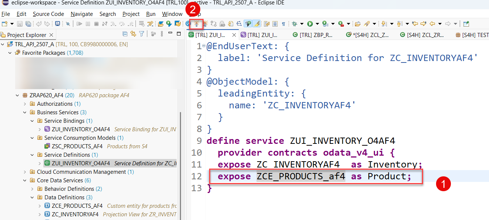  

## Exercise 3.5: Add the custom entity as a value help
[^Top of page](#exercise-3-consume-a-remote-api-based-on-an-odata-service)  

The custom entity can now be added as a value help.  

Click to expand

1. Open the projection view for your inventory data `ZC_INVENTORY###` 

  -  Add the annotation `@Consumption.valueHelpDefinition` to the field `ProductID`
  
     <pre>
  @Consumption.valueHelpDefinition: [{ entity : {name: 'ZCE_PRODUCTS_###', element: 'Product'  } , useForValidation: true }]  
     </pre>

This will add the custom entity `ZCE_PRODUCTS_###` as a value help for the field `ProductId`.

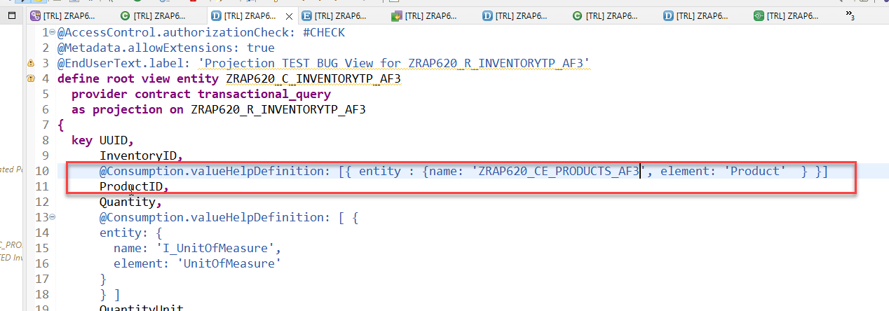  

## Exercise 3.6: Test the service 
[^Top of page](#exercise-3-consume-a-remote-api-based-on-an-odata-service)  

We can now test our service implementation.

Click to expand

1. Open the service binding `ZUI_INVENTORY_O4###` 

   - You will notice that now two entities are visible. `Products` and `Inventory`
   - Double-click on the entity `Inventory` or select it and use the **Preview** button.
   
     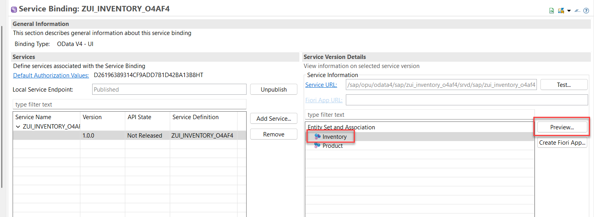

 
 
2. Use the new value help

   - Create a new inventory
   - Click on the value help icon
   - Select a product
    
    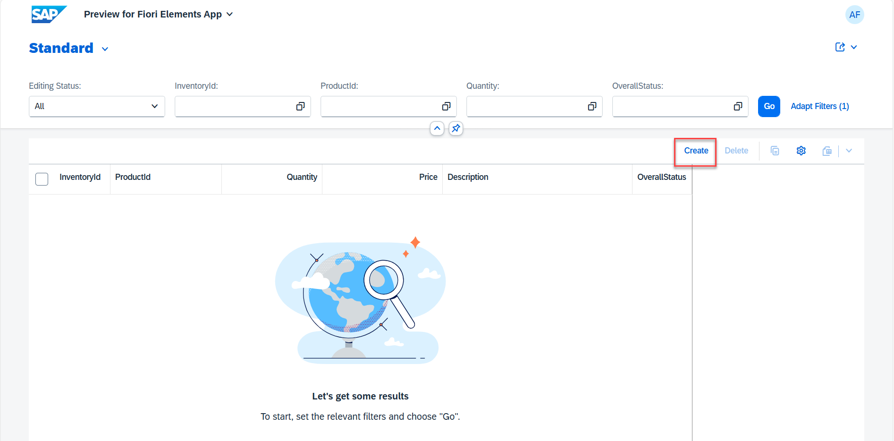

    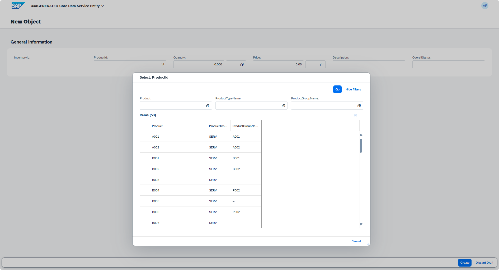
   
   

3. Create the new inventory 
 
  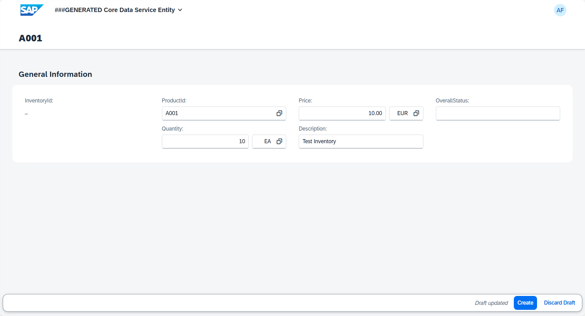

4. Check the result

  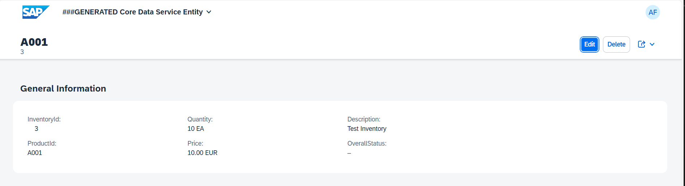

## Test input Validation on the front end
[^Top of page](#exercise-3-consume-a-remote-api-based-on-an-odata-service)   

1. Edit the newly created inventory entry

2. Change the product name to a product name that does not exist, e.g. by adding an arbritray character `a`.

   You will see that the SAP Fiori Elements UI performs a check whether the entered product name `A001a`does exist.

   This is because we have add earlier the annotation `@Consumption.valueHelpDefinition` to the field `ProductID` with the addtional parameter `useForValidation`.

<pre>
@Consumption.valueHelpDefinition: [{ entity : {name: 'ZCE_PRODUCTS_###', element: 'Product'  } , useForValidation: true }]        
</pre>

   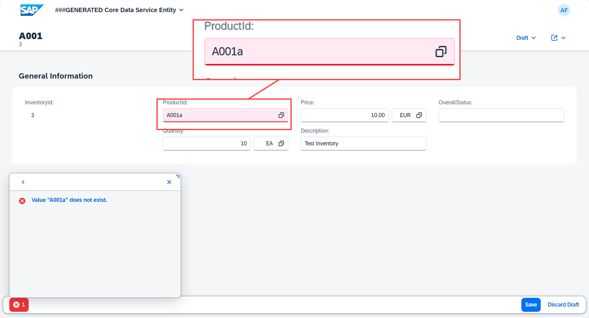

   

  

## Summary
[^Top of page](#)

You are now able to:

-	Explore an existing application with the Fiori Elements preview  
- Consume external OData Service using the Service Consumption Model  
-	Create and expose Custom Entites  
-	Implement Custom Queries for Custom Entities  
-	Define value helps for OData entities   

and have finished this hands-on script.  

<!--Continue to - [Exercise 4 - Excercise 4 ](../ex4/README.md/#exercise-4---consume-a-soap-web-service)-->
